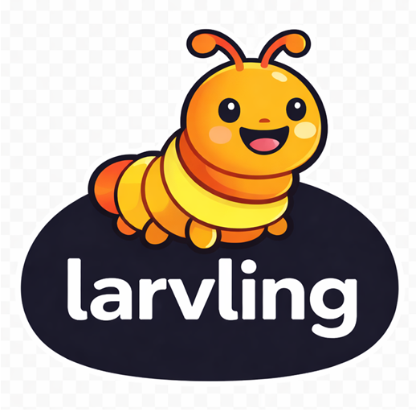

<p align="center">
  
</p>

# Larvling

Your friendly memory companion for Claude Code. Larvling quietly imprints every conversation - prompts, responses, tool usage - and keeps it all in a searchable dashboard. No config needed, just install and go.

## The 6 Principles of Larvling

- **Tiny** - under 50 KB of logic, under 100 KB total
- **Zero dependencies** - no pip install, no node_modules, no build step
- **Portable** - works on any device that supports Claude Code plugins: macOS, Linux, Windows
- **Private** - all data stays local in a single SQLite file
- **Instant** - no setup, no config, no onboarding
- **Lightweight** - SQLite WAL mode means near-zero overhead

## Install

Requires Claude Code 1.0.33+.

**From the terminal (CLI):**

```bash
# Add the marketplace source
claude plugin marketplace add https://github.com/athrael-soju/Larvling

# Install the plugin (local scope - this repo only)
claude plugin install larvling@athrael-soju --scope local
```

**From within Claude Code:**

```
/plugin marketplace add https://github.com/athrael-soju/Larvling
/plugin install larvling@athrael-soju --scope local
```

**For local development / testing:**

```bash
claude --plugin-dir ./larvling
```

> **Tip:** `--plugin-dir` loads the plugin directly from the repo - no caching involved. This is the simplest way to iterate on changes.

## Local Development

When Larvling is installed via `plugin install`, Claude Code copies the plugin files into a **cache directory** and runs hooks from there - not from the repo. This means editing files in the repo has no immediate effect on the running plugin.

### How to test changes

**Option A - `--plugin-dir` (recommended):**

```bash
claude --plugin-dir ./larvling
```

This bypasses the cache entirely and loads the plugin straight from the repo. Changes take effect on the next session start.

**Option B - Reinstall the plugin:**

```bash
claude plugin uninstall larvling@larvling
claude plugin install larvling@athrael-soju --scope local
```

This refreshes the cache with the latest files from the repo. Requires restarting the session.

**Option C - Copy files to the cache manually:**

```bash
# Find the cache directory
# Linux / macOS
ls ~/.claude/plugins/cache/athrael-soju/larvling/

# Windows
dir %USERPROFILE%\.claude\plugins\cache\athrael-soju\larvling\
```

Copy your changed files into the cache directory (note: the cache uses a **flat structure** - there is no `larvling/` prefix inside it). Restart the session to pick up the changes.

### Cache gotchas

- The cache path includes a hash suffix (e.g., `b378d4eab0ee`) that changes when the plugin is reinstalled
- `${CLAUDE_PLUGIN_ROOT}` in hooks and commands points to the cache, not the repo
- Committing + updating the plugin via `plugin install` also refreshes the cache

## How It Works

Larvling hooks into the Claude Code lifecycle and remembers everything:

- **Imprints** every user prompt and agent response to a local SQLite database
- **Recalls** past session context on startup so the agent picks up where it left off
- **Generates** a two-panel HTML dashboard with search, sort, and filter

## Commands

| Command | What it does |
|---------|-------------|
| `/summarize` | Generate an LLM-written summary of a session. Stored in the DB for context injection and downloadable from the dashboard |
| `/export` | Export a session's full conversation to a markdown file |
| `/delete` | Permanently delete a session and all its imprints from the database |
| `/search` | Search across all session content with grouped results and context snippets |

## Dashboard


The dashboard at `.claude/dashboard.html` provides a two-panel view of all sessions. Each session has a "..." menu with:

- **Download summary** - save the LLM-generated summary as a markdown file (only shown if a summary exists)
- **Export session** - download the full conversation as markdown

The dashboard polls every 3 seconds and reloads automatically when new data is available.

## Files

| File | What it does |
|------|-------------|
| `larvling/.claude-plugin/plugin.json` | Plugin manifest - name and description |
| `larvling/hooks/hooks.json` | Hook definitions - tells Claude Code when to call Larvling |
| `larvling/scripts/preflight.py` | Wakes up on session start, creates the DB or recalls context |
| `larvling/scripts/hooks.py` | Handles prompt logging, response capture, and session end |
| `larvling/scripts/dashboard.py` | Builds the HTML dashboard from the imprints |
| `larvling/scripts/dashboard.html.template` | HTML/CSS/JS template for the dashboard |
| `larvling/scripts/summarize.py` | DB helpers for the `/summarize` command |
| `larvling/scripts/export.py` | Exports a session conversation to markdown |
| `larvling/scripts/delete.py` | Deletes a session's imprints from the database |
| `larvling/scripts/search.py` | Searches across all session content |
| `larvling/scripts/db.py` | Shared database helpers |
| `larvling/commands/summarize.md` | Slash command definition for `/summarize` |
| `larvling/commands/export.md` | Slash command definition for `/export` |
| `larvling/commands/delete.md` | Slash command definition for `/delete` |
| `larvling/commands/search.md` | Slash command definition for `/search` |
| `larvling/CLAUDE.md` | Instructions for the agent |

## Uninstall

**From the terminal (CLI):**

```bash
claude plugin uninstall larvling@larvling

# Optionally remove the marketplace source
claude plugin marketplace remove athrael-soju
```

**From within Claude Code:**

```
/plugin uninstall larvling@larvling

# Optionally remove the marketplace source
/plugin marketplace remove larvling
```

To also remove stored data, delete the Larvling files from your project's `.claude/` directory:

```bash
rm .claude/larvling.db .claude/larvling.db-wal .claude/larvling.db-shm .claude/dashboard.html
```

## Data

All data stays local in the project's `.claude/` directory:

- `larvling.db` - SQLite database (WAL mode) with all imprints
- `dashboard.html` - static HTML dashboard, refreshed automatically
