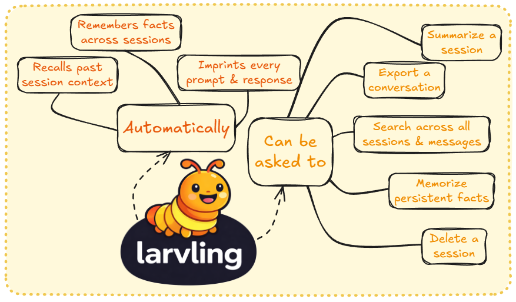

<p align="center">
  
</p>

# Larvling

Your friendly memory companion for Claude Code. Larvling quietly records every conversation - prompts, responses, tool usage - and keeps it all searchable. No config needed, just install and go.

## Built to be

- **Tiny** - under 100 KB
- **Portable** - works on any device that supports Claude Code plugins: macOS, Linux, Windows
- **Private** - all data stored locally in a single SQLite file
- **Instant** - no setup, no config, no onboarding
- **Lightweight** - SQLite WAL mode means near-zero overhead

## Install

Requires Claude Code 1.0.33+.

**1. Add the marketplace source:**

```bash
# From the terminal
claude plugin marketplace add https://github.com/athrael-soju/Larvling

# Or from within Claude Code
/plugin marketplace add https://github.com/athrael-soju/Larvling
```

**2. Install the plugin with your preferred scope:**

| Scope   | Flag              | Effect                                                                 |
| ------- | ----------------- | ---------------------------------------------------------------------- |
| Local   | `--scope local`   | Active only in the current project                                     |
| Project | `--scope project` | Active for all users of the project (writes to `.claude/plugins.json`) |
| User    | `--scope user`    | Active across all your projects                                        |

```bash
# From the terminal
claude plugin install larvling@athrael-soju --scope local

# Or from within Claude Code
/plugin install larvling@athrael-soju --scope local
```

> **Which scope should I use?** `local` is recommended for most users - it keeps Larvling scoped to the project you're working in. Use `user` if you want Larvling active everywhere, or `project` to share the plugin config with your team via source control.

**For local development / testing:**

```bash
claude --plugin-dir ./larvling
```

> **Tip:** `--plugin-dir` loads the plugin directly from the repo - no caching involved. This is the simplest way to iterate on changes.

### Alternative: Copy into the repo

You can copy the `larvling/` directory directly into your project's repository. This ensures the SQLite database (stored in `.claude/`) stays tied to the project and persists across sessions, environments, and machines.

```bash
# Copy the plugin into your repo
cp -r /path/to/Larvling/larvling ./larvling

# Run Claude Code with the local copy
claude --plugin-dir ./larvling
```

This approach is useful when:

- You want the database to live alongside your project and survive environment rebuilds (e.g., containers, Codespaces, CI)
- You work across multiple machines and sync the repo (the `.claude/` directory travels with it)
- You prefer not to rely on the plugin marketplace or cache

> **Note:** Add `larvling/` to `.gitignore` if you don't want to track the plugin files themselves. The database lives in `.claude/`, which you may also want to gitignore depending on your workflow.

## Local Development

When Larvling is installed via `plugin install`, Claude Code copies the plugin files into a **cache directory** and runs hooks from there - not from the repo. This means editing files in the repo has no immediate effect on the running plugin.

### How to test changes

**Option A - `--plugin-dir` (recommended):**

```bash
claude --plugin-dir ./larvling
```

This bypasses the cache entirely and loads the plugin straight from the repo. Changes take effect on the next session start.

**Option B - Reinstall the plugin:**

```bash
claude plugin uninstall larvling@athrael-soju
claude plugin install larvling@athrael-soju --scope local
```

This refreshes the cache with the latest files from the repo. Requires restarting the session.

**Option C - Copy files to the cache manually:**

```bash
# Find the cache directory
# Linux / macOS
ls ~/.claude/plugins/cache/athrael-soju/larvling/

# Windows
dir %USERPROFILE%\.claude\plugins\cache\athrael-soju\larvling\
```

Copy your changed files into the cache directory (note: the cache uses a **flat structure** - there is no `larvling/` prefix inside it). Restart the session to pick up the changes.

### Cache gotchas

- The cache path includes a hash suffix (e.g., `b378d4eab0ee`) that changes when the plugin is reinstalled
- `${CLAUDE_PLUGIN_ROOT}` in hooks and skills points to the cache, not the repo
- Committing + updating the plugin via `plugin install` also refreshes the cache

## Larvling's core skills

<p align="center">
  
</p>

## Skills

| Skill                 | What it does                                                        |
| --------------------- | ------------------------------------------------------------------- |
| `/remember`           | Store knowledge that persists across sessions                       |
| `/recall`             | Search stored knowledge by keyword, topic, or context               |
| `/forget`             | Remove stored knowledge (with confirmation)                         |
| `/sessions`           | Browse and search past sessions by date, keyword, or topic          |
| `/summarize`          | Generate or view an LLM-written session summary                     |
| `/export`             | Export a session conversation to markdown                           |
| `/status`             | Quick overview of Larvling's state (counts, DB size, version)       |
| `/query`              | Run arbitrary SQL against larvling.db                               |

## Files

| File                                      | What it does                                                |
| ----------------------------------------- | ----------------------------------------------------------- |
| `larvling/.claude-plugin/plugin.json`     | Plugin manifest - name and description                      |
| `larvling/hooks/hooks.json`               | Hook definitions - tells Claude Code when to call Larvling  |
| `larvling/scripts/db.py`                  | Database helpers, schema creation, and version management   |
| `larvling/scripts/transcript.py`          | Transcript parsing utilities for hook scripts               |
| `larvling/scripts/preflight.py`           | Schema bootstrap — ensures DB and tables exist              |
| `larvling/scripts/hooks/session_start.py` | Injects session context, checks for updates                 |
| `larvling/scripts/hooks/prompt.py`        | Logs user prompts and injects context hints                 |
| `larvling/scripts/hooks/stop.py`          | Logs responses, computes quality signals, tracks token usage|
| `larvling/scripts/hooks/failure.py`       | Records tool failures as quality signals                    |
| `larvling/scripts/hooks/session_end.py`   | Finalizes session timing and exchange count                 |
| `larvling/scripts/extract.py`             | Unified extraction - knowledge, sentiment, session tags, tasks, token usage |
| `larvling/scripts/summarize.py`           | Fetches conversation pairs and stores session summaries     |
| `larvling/scripts/export.py`              | Exports a session conversation to markdown                  |
| `larvling/scripts/query.py`               | Runs arbitrary SQL against larvling.db                      |
| `larvling/skills/*.md`                    | Skill definitions (remember, recall, forget, etc.)          |
| `larvling/agents/knowledge-manager.md`    | Subagent for autonomous knowledge management                |
| `larvling/CLAUDE.md`                      | Instructions for the agent                                  |

## Uninstall

```bash
# From the terminal (use the same scope you installed with)
claude plugin uninstall larvling@athrael-soju --scope local

# Or from within Claude Code
/plugin uninstall larvling@athrael-soju --scope local

# Optionally remove the marketplace source
claude plugin marketplace remove athrael-soju
```

To also remove stored data, delete the Larvling files from your project's `.claude/` directory:

```bash
rm .claude/larvling.db .claude/larvling.db-wal .claude/larvling.db-shm .claude/larvling.jsonl
```

## Data

All data is stored locally in the project's `.claude/` directory:

- `larvling.db` - SQLite database (WAL mode) with sessions, messages, knowledge, and tasks
- `larvling.jsonl` - structured JSONL debug log (one JSON object per line, machine-parseable)

When the plugin updates with schema changes, Larvling automatically backs up your database and guides the agent through the migration - your data is preserved.
